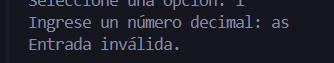

#  Conversor de números en Python

Este programa convierte un número decimal a diferentes sistemas númericos: binario, hexadecimal, octal y booleano. Además.

---

##  Función `convertir(numero)`

```python
def convertir(numero):
```

Esta función recibe un número decimal y devuelve un **diccionario** con sus conversiones.

```python
return {
    "Binario": bin(numero),
    "Hexadecimal": hex(numero),
    "Octal": oct(numero),
    "Booleano": bool(numero)
}
```

### ¿Qué hace cada conversión?

- `bin(numero)` → convierte a **binario**
- `hex(numero)` → convierte a **hexadecimal**
- `oct(numero)` → convierte a **octal**
- `bool(numero)` → indica si el número es:
  - `True` → distinto de 0
  - `False` → igual a 0

---

##  Función `menu()`

Esta función controla la interacción con el usuario mediante un menu.

```python
while True:
```

Crea un ciclo infinito para que el menú se repita hasta que el usuario salga.

---

### Mostrar opciones

```python
print("1. Convertir")
print("2. Salir")
```

Permite elegir entre convertir un número o cerrar el programa.


---

### Leer opción del usuario

```python
opcion = input("Seleccione una opción: ")
```

---

### Salir del programa

```python
if opcion == "2":
    break
```

Detiene el ciclo y termina el programa.


---

### Convertir número

```python
numero = int(input("Ingrese un número decimal: "))
```

Pide un número y lo convierte a entero.


Luego:

```python
resultados = convertir(numero)
```

Llama a la función de conversión.

---

### Mostrar resultados

```python
for tipo, valor in resultados.items():
```

Recorre el diccionario e imprime cada conversión.


---

### Manejo de errores

```python
except ValueError:
```

Evita que el programa falle si el usuario escribe un valor no númerico.



#  Resumen

 - `Recibe un número decimal`  
 - `Lo convierte a varios sistemas númericos`
 - `Muestra resultados`